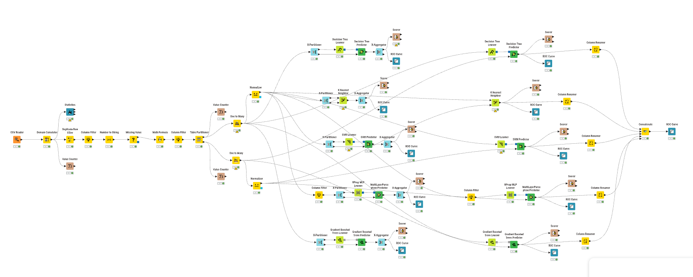

# Loan Repayment Analytics and Classification

## Overview

This project combines exploratory borrower analysis with a KNIME classification workflow for predicting loan repayment outcomes. The work covers data quality, risk-factor interpretation, feature engineering, cross-validation and a final holdout comparison across five classifiers.

## Exploratory analysis

The exploratory stage used a 3,000-record borrower dataset and an Excel workbook with reproducible calculations and visual evidence. The main findings were:

- Credit score was the strongest observed risk indicator.
- Debt-to-income ratio was the next most important factor.
- Annual income was misleading when considered alone.
- Loan amount did not clearly separate repayment outcomes.
- Education showed an ordinal risk gradient.
- Delinquency history was closely associated with credit score and repayment risk.
- The observed default rate was 20%, making class-specific metrics important.

## KNIME workflow

The classification stage used `trainData.csv` with 18,000 records and 21 columns. The workflow removes identifier and redundant income fields, creates a credit-utilisation feature, handles missing values and nominal variables, normalises where required, and compares:

- Decision Tree
- k-Nearest Neighbours
- Support Vector Machine with a polynomial kernel
- Multilayer Perceptron
- Gradient Boosted Trees

Cross-validation is used for model development, followed by evaluation on a separate 30% holdout partition.

## Holdout results

| Model | Accuracy | Macro F1 | Default precision | Default recall |
|---|---:|---:|---:|---:|
| Gradient Boosted Trees | 90.28% | 81.63% | 94.81% | 54.27% |

The gradient-boosted model delivered the strongest overall holdout result, with 4,875 correct predictions out of 5,400 cases. Its high default precision but moderate default recall means it was conservative: most predicted defaults were correct, but 493 actual defaults were missed. The report therefore treats accuracy and class-specific metrics together rather than claiming that accuracy alone is sufficient.

## Repository contents

- `workflow/README.md` — workflow availability and re-export note
- `data/loan_repayment_exploration.xlsx` — exploratory workbook
- `docs/exploratory_analysis.pdf` — exploratory analysis report
- `docs/classification_report.pdf` — classification methods, evaluation and recommendation
- `images/knime_workflow.png` — workflow overview

The modelling CSV is not included because it was supplied for coursework. A portable KNIME export is also not included because the available export did not pass an integrity check; the workflow overview and evaluated results are provided instead. See [workflow/README.md](workflow/README.md) for reproduction notes.

## Project context

Individual university project completed for Financial Data Analytics.
